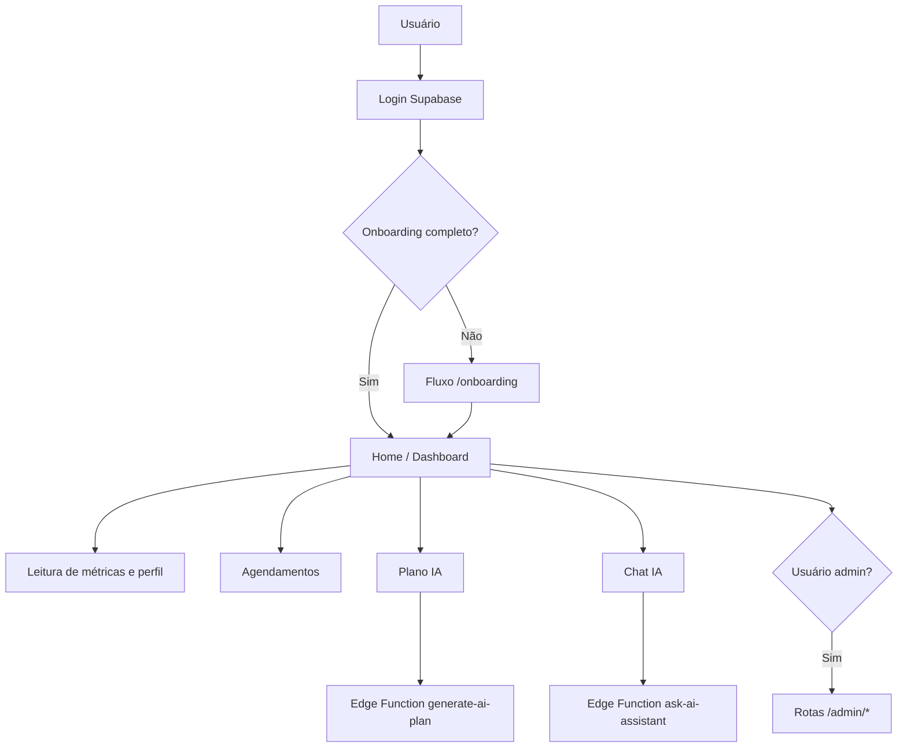

# Lyra MetaCare

Uma aplicação web para acompanhamento de saúde e longevidade com foco em jornada do usuário, métricas diárias, plano assistido por IA, chat e operação administrativa.

---

## 🧭 1. Visão Geral do Projeto

### O que é o projeto
O Lyra MetaCare é um sistema web construído com Next.js (App Router), React e TypeScript, com backend em Supabase (Auth, Postgres, Storage e Edge Functions).

### Qual problema resolve
O projeto consolida em uma única experiência:
- onboarding e perfil de usuário;
- acompanhamento de métricas de saúde;
- gestão de consultas/profissionais;
- plano personalizado gerado por IA;
- chat assistido por IA;
- operação administrativa de usuários, conteúdo e configuração de IA.

### Para quem foi criado
- Usuários finais que acompanham sua jornada de saúde;
- Administradores que operam conteúdo e parâmetros de IA;
- Times técnicos que mantêm o produto (engenharia full-stack com Next.js + Supabase).

### Cenários de uso reais (identificados no código)
1. Usuário faz login, conclui onboarding e atualiza perfil.
2. Usuário visualiza dashboard e métricas recentes.
3. Usuário agenda, edita ou cancela consultas com profissionais cadastrados.
4. Usuário gera plano de longevidade personalizado e consulta recomendações.
5. Usuário interage com chat de assistência.
6. Admin acessa áreas de conteúdo, usuários, relatórios e configuração de IA.

### Nível de maturidade
**Beta funcional**: há funcionalidades completas de produto, mas também existem trechos com fallback/mock explícito em partes de IA.

### Diferenciais técnicos reais
- RLS no banco para isolamento de dados por usuário;
- RBAC com role em `profiles` e função SQL `is_admin()`;
- Edge Functions para lógica de IA desacoplada da UI;
- Componentização por domínio + biblioteca de UI reutilizável.

### Sugestões de imagens para este README
- 🖼️ Screenshot principal: dashboard autenticado (`/`).
- 🖼️ Screenshot de jornada: fluxo Login → Onboarding → Home.
- 🖼️ Screenshot administrativo: página `/admin/dashboard`.
- 🖼️ Fluxo geral do sistema (diagrama abaixo).

---

## 🏗️ 2. Arquitetura do Sistema

### Modelo arquitetural
- **Front-end monolítico modular** com Next.js App Router.
- **Backend BaaS** com Supabase (Auth + DB + Storage + Edge Functions).
- **Observabilidade** com Sentry no client/server/edge.

### Stack tecnológica detalhada

| Camada | Tecnologia confirmada |
|---|---|
| Aplicação web | Next.js 15, React 19, TypeScript |
| UI | Tailwind CSS, Radix UI, shadcn/ui, Lucide |
| Formulários e validação | React Hook Form + Zod |
| Dados e autenticação | Supabase JS, Supabase SSR, Supabase Auth UI |
| Gráficos/visualização | Recharts, Tremor, react-big-calendar |
| Testes | Vitest |
| Monitoramento | Sentry (`@sentry/nextjs`) |
| Funções serverless | Supabase Edge Functions (Deno) |

### Camadas e comunicação interna
1. **Camada de rota/página** (`src/app/*`): compõe layouts e fluxos de acesso.
2. **Camada de componentes** (`src/components/*`): UI por domínio e componentes base.
3. **Camada de estado e sessão** (`src/context/AuthContext.tsx`): sessão, role, redirecionamento.
4. **Camada de dados** (`src/hooks/*`, `src/integrations/supabase/*`): queries, invocações e normalização.
5. **Camada backend** (`supabase/*`): schema, RLS, RPC/funções SQL, Edge Functions.

### Diagrama textual
```text
[Navegador]
   │
   ▼
[Next.js App Router]
   ├─ AuthContext (sessão/role/redirecionamento)
   ├─ Hooks de dados (métricas/scores/admin)
   ├─ Componentes UI/feature
   └─ Invocação de Edge Functions
   │
   ▼
[Supabase]
   ├─ Auth (JWT)
   ├─ Postgres + RLS + funções SQL
   ├─ Storage (professional_avatars)
   └─ Edge Functions (chat, plano, score, teste IA)
```

### Diagrama Mermaid (fluxo principal)


### Fluxo de dados (explicação amigável)
- O usuário autentica via Supabase Auth UI.
- O `AuthContext` decide o destino (login, onboarding ou home).
- As telas consultam dados no Supabase usando session/JWT.
- Recursos de IA chamam Edge Functions com token do usuário.
- O banco aplica RLS para garantir isolamento de dados.

### Integrações externas identificadas
- Supabase (Auth, DB, Storage, Functions);
- Sentry;
- Endpoint HTTP externo de IA testado em `test-ai-connection`.

Informação não identificada no código-fonte atual: contratos formais de integração (OpenAPI/SDK publicado).

---

## 👤 3. Manual do Usuário (User Guide)

### Pré-requisitos
- Node.js instalado.
- pnpm (recomendado pelo `pnpm-lock.yaml`).
- Projeto Supabase configurado com migrações e secrets.

Informação não identificada no código-fonte atual: versão mínima/exata de Node.js exigida.

### Instalação (passo a passo)
```bash
pnpm install
```

### Configuração de ambiente
Variáveis lidas no app web:

| Variável | Finalidade |
|---|---|
| `NEXT_PUBLIC_SUPABASE_URL` | Cliente server-side Supabase |
| `NEXT_PUBLIC_SUPABASE_PUBLISHABLE_KEY` | Cliente server-side Supabase |
| `NEXT_PUBLIC_SENTRY_DSN` | Sentry client/server/edge |
| `NODE_ENV` | Comportamentos de build/dev |

Secrets lidas nas Edge Functions:

| Secret | Finalidade |
|---|---|
| `SUPABASE_URL` | Acesso Supabase nas functions |
| `SUPABASE_ANON_KEY` | Cliente com contexto do usuário |
| `SUPABASE_SERVICE_ROLE_KEY` | Leitura privilegiada de configuração |
| `OPENAI_API_KEY` | Resposta real no assistente IA |

Observação técnica importante 🔐:
- Há URL e chave publicável do Supabase hardcoded no cliente web.

### Executar em desenvolvimento
```bash
pnpm dev
```
Acesse `http://localhost:3000`.

### Executar testes
```bash
pnpm test
```

### Build de produção
```bash
pnpm build
pnpm start
```

### Exemplos práticos de uso
- **Novo usuário**: login → onboarding → dashboard.
- **Usuário recorrente**: login → métricas/consultas/plano/chat.
- **Admin**: login → `/admin/dashboard` → gestão de conteúdo/usuários/IA.

---

## 🎨 4. Experiência do Usuário (UI/UX Detalhada)

### Jornada do usuário
1. **Entrada**: login social/email na rota `/login`.
2. **Progressão obrigatória**: onboarding para novos usuários.
3. **Operação principal**: dashboard com navegação por sidebar/header.
4. **Funcionalidades especializadas**: perfil, metas, monitoramento, chat, plano, consultas.
5. **Operação administrativa**: páginas `/admin/*` restritas por role.

### Fluxo de navegação
- Navegação principal baseada em layout com `Sidebar` + `Header` nas áreas autenticadas.
- Splash screen de carregamento para reduzir flicker durante inicialização de sessão.

### Hierarquia visual e componentes principais
- Estrutura com cards, grids, tabs, dialogs e formulários (`src/components/ui/*`).
- Conteúdo por domínio (`appointments`, `chat`, `goals`, `monitoring`, `admin`, etc.).
- Feedback de ações via toasts (`sonner`).

### Estados de interface
- **Loading**: `SplashScreen` e `Skeleton` em páginas e componentes.
- **Erro**: `toast.error` em operações de fetch/salvamento.
- **Sucesso**: `toast.success` para operações concluídas.
- **Acesso negado**: cards dedicados em rotas admin para usuários sem permissão.

### Feedback visual e interação
- Feedback imediato em CRUD (cadastro/edição/exclusão) com mensagens contextuais.
- Padrão de modais para edição e confirmação destrutiva.

### Acessibilidade identificável
- Uso de primitives Radix UI (boa base para foco/teclado/ARIA).
- Informação não identificada no código-fonte atual: auditoria formal de acessibilidade (WCAG) e métricas de contraste/testes automatizados a11y.

### Responsividade
- Uso frequente de classes Tailwind responsivas (`sm:`, `md:`, `lg:`).
- Layout adaptável para mobile/desktop com componentes de navegação dedicados.

### Sugestões de imagens UI/UX para documentação
- 🖼️ Home autenticada com greeting e métricas.
- 🖼️ Tela de onboarding (passos com carousel).
- 🖼️ Agenda de consultas (calendário + modal).
- 🖼️ Painel admin (cards de estatísticas e usuários recentes).
- 🖼️ Wireframe simples do fluxo de navegação (login → onboarding → módulos).

---

## ⚙️ 5. Manual de Utilização Avançada

### Parâmetros configuráveis
- Configuração de IA (`ai_config`):
  - `mission`
  - `key_objectives`
  - `weight_hrv`
  - `weight_sleep`
  - `weight_activity`
  - `weight_nutrition`
  - `model_name`
- Campos de teste de integração na UI admin:
  - `training_endpoint`
  - `service_key`

### Customizações possíveis
- UI: componentes em `src/components/*`.
- Regras de dados e segurança: migrações SQL em `supabase/migrations/*`.
- Lógica de IA: Edge Functions em `supabase/functions/*`.

### Extensibilidade
- Adição de novas rotas no App Router.
- Inclusão de novos hooks de dados por domínio.
- Evolução de schema com novas migrações versionadas.

### Integrações externas
- Chamada HTTP para endpoint de IA externo (`test-ai-connection`).
- Sentry para monitoramento técnico.

### Limitações técnicas reais
- Trechos de mock/fallback em funções de IA.
- Campos administrativos com defaults de teste.
- Informação não identificada no código-fonte atual: documentação operacional formal de deploy e runbook.

---

## 🧠 6. Documentação Técnica Interna

### Estrutura de diretórios

| Caminho | Papel técnico |
|---|---|
| `src/app` | Páginas/rotas App Router |
| `src/components` | Componentes por domínio + UI base |
| `src/context` | Contextos globais (Auth) |
| `src/hooks` | Hooks de leitura/cálculo/controle de acesso |
| `src/integrations/supabase` | Clientes Supabase client/server |
| `src/lib` | Tipos e utilitários |
| `supabase/functions` | Edge Functions Deno |
| `supabase/migrations` | Schema, RLS, RBAC e storage policies |

### Módulos principais
- `AuthContext`: sessão, role e redirecionamento condicional.
- `useDailyMetrics`: busca e preenchimento de lacunas temporais de métricas.
- `useAIScores`: consulta score via Edge Function.
- `AIPlanContent`: geração e renderização de plano personalizado.
- `AppointmentsContent`: CRUD de profissionais/consultas.
- `AdminDashboardContent` e correlatos: operação administrativa.

### Principais funções e pontos de entrada
- `createServerSupabaseClient()`.
- `ensureProfileExists()` e `handleRedirects()`.
- `useDailyMetrics()` e `useAIScores()`.
- `serve(async (req) => ...)` nas Edge Functions.

### Tratamento de erros
- Front-end: `toast.error` + logs em console.
- Edge Functions: `try/catch` com resposta HTTP de erro estruturada.
- Fallback explícito em alguns fluxos de IA para evitar quebra da UI.

### Logging
- `console.log`, `console.warn`, `console.error` em client e edge.
- Sentry configurado para client/server/edge.

### Estratégia de testes
- Teste unitário de schema (Vitest) em `ProfileForm.test.ts`.
- Informação não identificada no código-fonte atual: suíte E2E oficial.

### Versionamento
- Uso de Git no repositório.
- Informação não identificada no código-fonte atual: política formal de versionamento semântico (tags/releases).

### CI/CD
Informação não identificada no código-fonte atual.

---

## 🔐 7. Segurança

### Pontos críticos identificados
- URL/chave Supabase publicável hardcoded no cliente.
- Valor default de chave de serviço em formulário admin.
- CORS permissivo (`*`) nas Edge Functions.

### Validação de dados
- Zod para validação de formulários.
- RLS por `auth.uid()` para isolamento entre usuários.
- RBAC com role em `profiles` e função SQL `is_admin()`.

### Dependências sensíveis
- Supabase SDK/SSR.
- Next.js e React (superfície de app web).
- Sentry (telemetria de erros).

### Recomendações técnicas
1. Remover hardcodes e migrar configurações para ambiente/secret.
2. Restringir CORS por domínio confiável em produção.
3. Separar explicitamente modo demo de modo produção nas funções de IA.
4. Revisar periodicamente RLS/RBAC após cada migração.

---

## 🚀 8. Performance

### Pontos que impactam performance
- Seleção de grande conjunto de colunas em `daily_metrics`.
- Parte das telas admin realiza múltiplas consultas de contagem/listagem.
- Dependência de roundtrips de rede para Edge Functions.

### Gargalos identificáveis
- Falta de paginação explícita em algumas listagens administrativas.
- Chamadas de IA podem degradar UX em latência alta.

### Estratégias atuais
- Skeletons e estados de loading para percepção de fluidez.
- Uso pontual de paralelização (`Promise.all`) em consultas.
- Filtros por período e ordenação em consultas de métricas.

### Recomendações técnicas
- Introduzir paginação e/ou virtualização em listas grandes.
- Consolidar consultas administrativas com RPC quando necessário.
- Adotar cache estratégico para dados estáveis de configuração.

---

## 🗺️ 9. Roadmap Técnico

### TODOs e lacunas observáveis no código
- Comentários de placeholder/fallback em integrações IA.
- Função de teste de conexão retorna modelos mockados.

### Módulos parcialmente implementados
- Integração com provedor externo de IA sem contrato único consolidado em todo o fluxo.
- Observabilidade funcional existe, mas sem evidência de política operacional completa.

### Evoluções naturais coerentes com a arquitetura
1. Definir contrato versionado de IA (request/response) entre UI e Edge Functions.
2. Expandir cobertura de testes para hooks críticos e Edge Functions.
3. Formalizar documentação operacional (provisionamento, secrets, rollback).
4. Padronizar estratégias de erro para reduzir divergência de UX entre módulos.

---

## 📌 10. Conclusão Técnica

O Lyra MetaCare apresenta base arquitetural moderna e consistente para produto web de saúde/longevidade, combinando Next.js com Supabase e separação clara por domínios de UI.

### Grau de maturidade
**Beta funcional** com capacidade real de evolução para produção após hardening de segurança e integração de IA.

### Potencial de escalabilidade
Bom potencial, principalmente pela combinação App Router + Supabase + Edge Functions, desde que haja governança de integrações e observabilidade operacional.

### Pontos fortes
- Arquitetura coerente com stack atual de mercado.
- Boa modularização por domínio.
- Segurança de dados apoiada em RLS + RBAC.
- UX com estados de feedback visíveis (loading/sucesso/erro).

### Pontos frágeis
- Presença de hardcodes sensíveis e defaults inseguros.
- Dependência de fallback/mock em trechos de IA.
- Cobertura de testes ainda enxuta.

---

## 📎 Referências rápidas
- Aplicação: `src/app/*`
- Componentes: `src/components/*`
- Autenticação/contexto: `src/context/AuthContext.tsx`
- Hooks de dados: `src/hooks/*`
- Tipos de banco: `src/lib/database.types.ts`
- Edge Functions: `supabase/functions/*`
- Migrações e políticas: `supabase/migrations/*`
