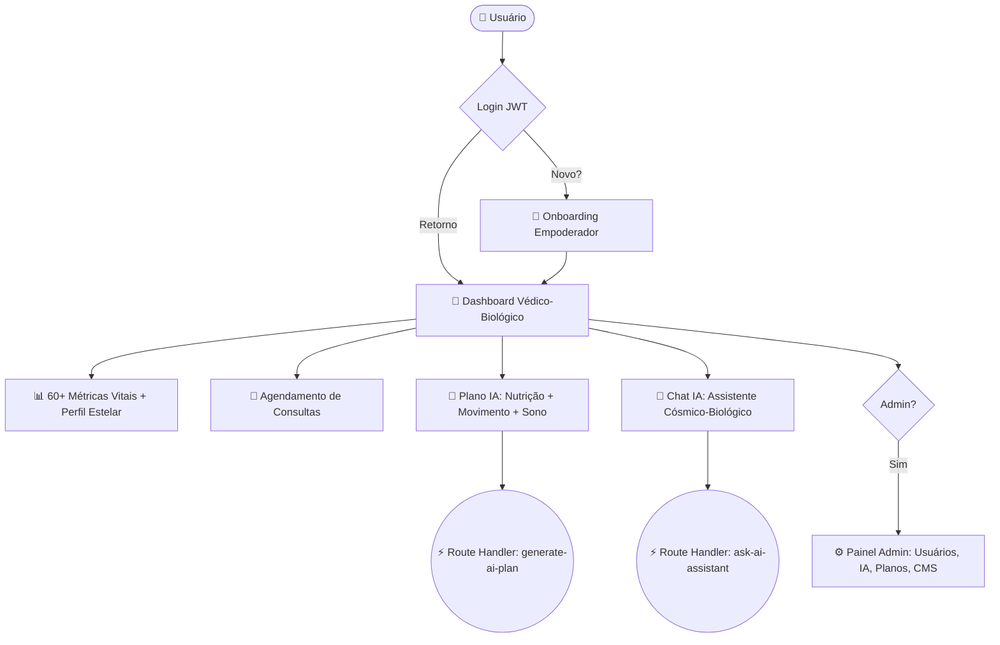

<div align="center">

# 🕉️✨ Lyra MetaCare — Plataforma Integrativa de Bem-Estar Quântico-Védico

**A Fusão Revolucionária da Sabedoria Milenar Védica com Medicina Moderna e Física Quântica** 🧬🪐⚛️

[](https://nextjs.org/)
[](https://react.dev/)
[](https://www.typescriptlang.org/)
[](https://www.mysql.com/)
[](https://tailwindcss.com/)
[](https://stripe.com/)
[](https://sentry.io/)
[](https://opensource.org/licenses/MIT)
[](#)

> 🔬 **Atenção: NÃO somos uma clínica médica.** Somos uma plataforma holística de **cuidado, saúde e bem-estar** que inova com uma metodologia proprietária: a fusão profunda da **Astrologia Védica (Jyotish)**, **Ayurveda**, **Vedas & Vedanta** com a **Medicina Moderna Baseada em Evidências** e **Física Quântica Aplicada**.

[**🕉️ Filosofia**](#-1-manifesto-e-filosofia) · [**🔥 Diferenciais**](#-2-o-que-nos-diferencia) · [**🚀 Features**](#-3-funcionalidades-e-inovações-exclusivas) · [**🏗️ Arquitetura**](#%EF%B8%8F-4-arquitetura-do-sistema) · [**📖 Guia**](#-5-guia-de-instalação-e-uso) · [**🛡️ Segurança**](#%EF%B8%8F-6-segurança-e-qualidade) · [**🗺️ Roadmap**](#%EF%B8%8F-7-roadmap)

</div>

---

## 🖼️ Preview da Interface: Estética 2026

Design em **Bento Grid** com **Glassmorphism avançado**, paleta **Lyra Teal** + **Warm Coral**, tipografia premium com Inter e micro-animações imersivas.

<p align="center">
  
</p>

---

## 🕉️ 1. Manifesto e Filosofia

### 🌌 O Que é o Lyra MetaCare?

O **Lyra MetaCare** é uma plataforma de **bem-estar integrativo** que cria uma ponte entre os sistemas ancestrais de conhecimento humano e a tecnologia de ponta do século XXI. A saúde verdadeira só emerge quando **corpo, mente, espírito e cosmos** operam em harmonia profunda.

Imagine um **ecossistema sincronizado em tempo real** onde a precisão cirúrgica da **Inteligência Artificial** 🧠 encontra a profundidade cósmica da **Astrologia Védica** 🕉️ e a sabedoria milenar do **Ayurveda** 🌿. Aqui, não rastreamos apenas números frios; nós **orquestramos o seu bem-estar holístico**.

### 🧬 A Metodologia MetaCare (Os 5 Pilares Fundacionais)

| # | Pilar | Tradição / Ciência | Aplicação Real no MetaCare |
|:-:|:---:|:---|:---|
| 1 | 🕉️ | **Astrologia Védica (Jyotish)** | Cálculo sideral real com Lahiri Ayanamsha via `astronomy-engine`. Nakshatras (27 constelações lunares), Tithis (30 fases), Pakshas (Shukla/Krishna) e trânsitos lunares que influenciam ritmos biológicos e psicológicos. |
| 2 | 🌿 | **Ayurveda** | Doshas dinâmicos (Vata/Pitta/Kapha) calculados a partir de biomarcadores reais do dia — HRV, temperatura, sono, digestão — não questionários estáticos. |
| 3 | 📜 | **Vedas & Vedanta** | Princípios de autoconsciência, propósito (Dharma) e equilíbrio dos Pancha Koshas (as 5 camadas do ser humano). |
| 4 | 🏥 | **Medicina Moderna** | 60+ biomarcadores científicos integrados: HRV (rMSSD), SpO₂, glicose contínua (CGM), VO₂max, pressão arterial, sono polifásico (REM/profundo/leve), recuperação cardíaca (HRR). |
| 5 | ⚛️ | **Física Quântica** | Índice de Coerência Quântica — convergência matemática entre estados biológicos e ciclos cósmicos. Princípio de ressonância e campo unificado aplicado ao bem-estar. |

### 🎨 Identidade Visual e Simbolismo

- 💫 **Símbolo:** Unificação da constelação de Lira 🌟 com ícones de saúde — "minimalismo geométrico fluido" que respira.
- ✍️ **Logotipo:** Tipografia sans-serif em caixa-baixa — comunicação amigável, humana e empática.
- 🌊 **Lyra Teal (Primária):** Convergência entre futurismo tecnológico e naturalidade orgânica da saúde.
- 🌅 **Warm Coral (Secundária):** Calor humano, paixão e energia radiante para engajamento positivo no autocuidado.
- 🎻 **Conceito "Orquestração":** _Seu Bem-Estar Orquestrado_ — harmonia entre pilares biológicos e ciclos astrológicos.

---

## 🔥 2. O Que Nos Diferencia

| Inovação | Descrição |
|:---|:---|
| 🧘 **Doshas Dinâmicos em Tempo Real** | Seu perfil ayurvédico muda conforme seus biomarcadores mudam — não é um rótulo fixo para a vida toda. |
| 🌙 **Astrologia Védica Computacional Real** | Cálculos siderais com `astronomy-engine` usando efemérides reais, não tabelas genéricas de internet. |
| ⚛️ **Índice de Coerência Quântica** | Métrica exclusiva que quantifica o alinhamento entre seu estado biológico vibracional e os ciclos cósmicos. |
| 🔮 **Chakra Alignment Score** | Mapeamento dinâmico dos 7 chakras com base em biomarcadores mensuráveis (HRV → Anahata, SpO₂ → Vishuddha). |
| 🌊 **Índice Pránico (Energia Vital)** | Calculado a partir de HRV, capacidade respiratória, SpO₂ e fase lunar. |
| 🧠 **IA On-Device com Consciência Cósmica** | Assistente que cruza dados fisiológicos com o céu védico em tempo real. |
| 📊 **60+ Métricas Científicas** | Do sono REM à variabilidade glicêmica (CV), da recuperação cardíaca ao estresse autonômico (EDA). |
| 🎯 **KPIs de Transformação** | Aderência, consistência (streaks), NPS de bem-estar, WHO-5 e avaliação diária de humor. |

---

## 🚀 3. Funcionalidades e Inovações Exclusivas

### 📊 3.1. Dashboard Védico-Biológico (Bento Grid Premium)
- **Card de Pulso Harmônico:** HRV em tempo real com gráfico de tendência semanal e status de prontidão.
- **Card Astrológico:** Lua sideral, Nakshatra, Tithi, Paksha e impacto direto no sono/energia/estresse.
- **Card de Sono:** Duração total, sono profundo, sono REM, eficiência e regularidade (SRI).
- **Insight IA Privado:** Recomendação diária processada localmente com contexto astro-biológico.
- **Mini-Cards:** Passos, Hidratação, Meditação, Glicose — com deltas percentuais comparativos.
- **Gráfico Semanal de Prontidão:** Evolução dos 7 últimos dias com score composto.

### 🧬 3.2. Pilares de Métricas (60+ Biomarcadores)

| Pilar | Métricas Incluídas |
|:---|:---|
| 💚 **Recuperação e Resiliência** | HRV (rMSSD), Prontidão, FC repouso, Recuperação FC (HRR), Temperatura, SpO₂ noturna |
| 🏃 **Cardio e Atividade Física** | VO₂max, Minutos moderados/vigorosos, Passos, Carga EPOC, Strain diário, Sedentarismo |
| 🌙 **Sono e Cronobiologia** | Duração, Eficiência, Regularidade SRI, Social Jetlag, Sono REM, Sono profundo |
| 🩸 **Metabolismo e Glicose (CGM)** | Tempo em faixa, Variabilidade CV, GMI (A1c estimada), Pico pós-prandial, TBR, iAUC |
| 🍎 **Nutrição e Composição** | WHtR, Proteína g/kg, Fibras, Janela alimentar, Na:K, Hidratação mL/kg |
| 🧠 **Saúde Mental e Foco** | Tempo de reação PVT, Lapsos, Score cognitivo, Estresse HRV, EDA tônica, FA, Humor, Meditação |
| 💪 **Saúde Geral** | Pressão arterial, Peso, Hidratação total, Calorias treino, Calorias totais |

### 🤖 3.3. Chat IA — O Orquestrador Inteligente
Motor de NLP determinístico local que cruza perfil cósmico com dados biológicos:
- Detecta intenções: sono, glicose, HRV, exercício, astrologia, resumo geral, consultas.
- Correlaciona dados fisiológicos com trânsitos planetários védicos.
- Gera respostas contextualizadas com base em metas pessoais do usuário.

### 📋 3.4. Plano de Bem-Estar IA
Geração automática de protocolo diário com 3 pilares:
- 🍎 **Nutrição:** Prescrição alimentar baseada em glicose, fase lunar e dosha.
- 🏋️ **Movimento:** Calibração de intensidade baseada em HRV, prontidão e energia cósmica.
- 🌙 **Sono:** Rotina noturna alinhada ao estado fisiológico e ao ciclo lunar vigente.

### 📈 3.5. KPIs, Métricas de Avaliação e Gamificação
- **Streak de Consistência:** Dias consecutivos com métricas preenchidas.
- **Mood Score Diário (1-5):** Rastreamento emocional correlacionado com a lua.
- **Score de Longevidade (0-10):** Calculado via motor IA com pesos configuráveis.
- **Score de Prontidão (0-100):** Capacidade de adaptação ao estresse do dia.
- **NPS Integrado:** Feedback orgânico sobre a jornada de bem-estar.

### 💰 3.6. Sistema de Assinaturas e Planos
- Planos gerenciados via **Stripe** com billing mensal/anual.
- Controle de features por entitlements (`dashboard_access`, `ai_scores`, `ai_tips_feed`).
- Gerenciamento completo no painel admin.

### ⚙️ 3.7. Painel Administrativo Completo
- Gestão de usuários, planos, dados de saúde e relatórios.
- Configuração dinâmica da IA: missão, objetivos, pesos das métricas, modelo LLM.
- CMS visual integrado com **Puck Editor** para páginas de conteúdo.

---

## 🏗️ 4. Arquitetura do Sistema

### 🏛️ Modelo Arquitetural
- 🖥️ **Front-end Monolítico Modular:** Next.js 15 App Router + React 19.
- 🗄️ **Backend:** Route Handlers do Next.js sobre MySQL 8.0+ com migrações versionadas.
- 👁️ **Observabilidade:** Sentry integrado (client, server, edge).
- 🎨 **CMS:** Puck Editor para gestão visual drag-and-drop de conteúdo.

### 🧱 Stack Tecnológica

| Camada 🌟 | Tecnologia 🛠️ |
|:---|:---|
| 🌐 **Aplicação** | Next.js 15, React 19, TypeScript 5 |
| 🎨 **UI/UX** | Tailwind CSS, Radix UI, shadcn/ui, Lucide Icons |
| 📝 **Forms & Validação** | React Hook Form + Zod |
| 🔐 **Autenticação** | JWT local, cookies HTTP-only, bcryptjs, RBAC (admin/patient) |
| 📊 **Visualização** | Recharts, Tremor, react-big-calendar |
| 🌌 **Motor Astrológico** | astronomy-engine (cálculos astronômicos reais) |
| 🧠 **Motor IA** | Score Engine + Chat Engine + Plan Engine (local, determinístico) |
| 💰 **Billing** | Stripe (assinaturas, webhooks, checkout) |
| 🗄️ **Banco de Dados** | MySQL 8.0 via mysql2/promise |
| 🐳 **Infraestrutura** | Docker Compose (MySQL containerizado) |
| 🧪 **Testes** | Vitest |
| 👁️ **Monitoramento** | Sentry (@sentry/nextjs) |

### 📐 Fluxo de Dados (Mermaid)


```mermaid
flowchart TD
    A([💖 Usuário]) --> B{Login JWT}
    B -- "Novo?" --> C[🚀 Onboarding Empoderador]
    B -- "Retorno" --> D[🏡 Dashboard Védico-Biológico]
    C --> D
    D --> E[📊 60+ Métricas Vitais + Perfil Estelar]
    D --> F[📅 Agendamento de Consultas]
    D --> G[🔮 Plano IA: Nutrição + Movimento + Sono]
    D --> H[🤖 Chat IA: Assistente Cósmico-Biológico]
    G --> I((⚡ Route Handler: generate-ai-plan))
    H --> J((⚡ Route Handler: ask-ai-assistant))
    D --> K{Admin?}
    K -- "Sim" --> L[⚙️ Painel Admin: Usuários, IA, Planos, CMS]
```

---

## 📖 5. Guia de Instalação e Uso

### 🛠️ Pré-requisitos
| Ferramenta | Versão Mínima |
|:---|:---|
| 🟢 Node.js | v20+ |
| 📦 pnpm | Último estável |
| 🐳 Docker + Docker Compose | Último estável |
| 🗄️ MySQL | 8.0+ (via Docker) |

### 🪄 Passo 1: Clonagem e Instalação
```bash
git clone https://github.com/ilyra-ai/Lyra-MetaCare.git
cd Lyra-MetaCare
pnpm install
```

### 🌍 Passo 2: Variáveis de Ambiente

Crie o arquivo `.env.local` na raiz do projeto com as seguintes variáveis:

**Variáveis do Aplicativo:**

| Variável | Descrição |
|:---|:---|
| `MYSQL_HOST` | Endereço do servidor MySQL |
| `MYSQL_PORT` | Porta interna do MySQL |
| `MYSQL_USER` | Usuário de acesso ao banco |
| `MYSQL_PASSWORD` | Senha do banco |
| `MYSQL_DATABASE` | Schema principal da aplicação |
| `AUTH_SECRET` | Segredo criptográfico para assinar sessões JWT |

**Variáveis de Bootstrap Admin:**

| Variável | Descrição |
|:---|:---|
| `ADMIN_BOOTSTRAP_EMAIL` | Email do administrador auto-criado nas migrações |
| `ADMIN_BOOTSTRAP_PASSWORD` | Senha do administrador (mínimo 8 caracteres) |
| `ADMIN_BOOTSTRAP_FIRST_NAME` | Nome exibido no perfil admin |
| `ADMIN_BOOTSTRAP_LAST_NAME` | Sobrenome exibido no perfil admin |
| `ADMIN_BOOTSTRAP_ADDITIONAL_ADMINS` | Array JSON opcional com admins extras |

**Variáveis de Infraestrutura e IA:**

| Variável | Descrição |
|:---|:---|
| `MYSQL_HOST_PORT` | Porta publicada pelo container MySQL na máquina local |
| `OPENAI_API_KEY` | Chave de API para respostas avançadas do assistente IA |
| `NEXT_PUBLIC_SENTRY_DSN` | DSN do Sentry para monitoramento (opcional em dev) |

> 🔐 **Importante:** Nunca faça commit de chaves reais. Sempre utilize `.env.local` para segredos.

### 🚀 Passo 3: Banco de Dados e Migrações
```bash
npm run db:start
```
Este comando: (1) sobe o container MySQL via Docker, (2) executa `scripts/mysql-migrate.mjs` aplicando todas as migrações SQL ordenadas, (3) injeta automaticamente o super administrador.

### 🌌 Passo 4: Iniciar o Servidor
```bash
pnpm dev
```
Acesse: **http://localhost:3000**

### ✅ Passo 5: Testes
```bash
pnpm test
```

### 🏭 Passo 6: Build de Produção
```bash
pnpm build && pnpm start
```

---

## 🛡️ 6. Segurança e Qualidade

### 🔒 Segurança de Dados
- **Validação com Zod:** Todos os inputs são sanitizados antes de tocar no banco.
- **Isolamento por Usuário:** Leitura e escrita filtradas pelo `user_id` do JWT em todas as rotas `/api/data/*`.
- **RBAC Real:** Controle de acesso por papéis (`admin` e `patient`) aplicado em rotas de autenticação, CRUD, storage e painéis.
- **Cookies HTTP-only:** Tokens JWT nunca expostos ao JavaScript do cliente.
- **Bcrypt com Salt:** Senhas hashadas com `bcryptjs` (10 rounds).

### 🏎️ Performance
- **Paralelismo:** Consultas ao banco via `Promise.all()` para eliminar gargalos.
- **Paginação SQL:** Padrão com `count`, `limit`, `range` e filtros seguros para payloads controlados.
- **Skeleton Loading:** Estados de carregamento pulsantes para zero flash de conteúdo.

### 🧪 Qualidade de Código
```bash
npm run fix:format    # Corrigir formatação (Prettier)
npm run fix:lint      # Corrigir lint (ESLint)
npm run check:lint    # Verificar lint
npm run check:format  # Verificar formatação
npm run check:types   # Verificar tipagem TypeScript (tsc --noEmit)
```

---

## 🎨 7. Experiência de Usuário (UI/UX)

### 🛤️ Jornada do Usuário
1. **🔐 Login:** Autenticação rápida na rota `/login`.
2. **🚀 Onboarding:** Fluxo imersivo de coleta de informações pessoais e metas.
3. **🏡 Dashboard:** Centro de comando com Bento Grid, sidebar e header responsivos.
4. **📊 Módulos Profundos:** Perfil, Metas, Monitoramento Diário, Chat IA, Planos IA, Consultas.
5. **⚙️ Admin:** Páginas exclusivas (`/admin/*`) para governança completa.

### 💎 Detalhes Premium
- **Splash Screen:** Tela de carregamento suave que elimina flicker.
- **Glassmorphism:** Cards translúcidos com `backdrop-blur`, bordas arredondadas (1rem+) e sombras glass.
- **Toast Notifications:** Feedbacks via `sonner` — animados e elegantes.
- **Estados Inteligentes:** Skeletons pulsantes (loading), toasts de erro/sucesso, cards de acesso negado.

---

## 🗺️ 8. Roadmap 🌠

| Fase | Descrição | Status |
|:---:|:---|:---:|
| ✅ | Dashboard Védico-Biológico com 60+ métricas | Completo |
| ✅ | Motor Astrológico Real (Lahiri, Nakshatras, Tithis) | Completo |
| ✅ | Motor IA: Score de Longevidade + Prontidão | Completo |
| ✅ | Chat IA Determinístico com NLP Local | Completo |
| ✅ | Plano de Bem-Estar IA (Nutrição/Movimento/Sono) | Completo |
| ✅ | Sistema de Assinaturas com Stripe | Completo |
| ✅ | Painel Admin com CMS Puck | Completo |
| 🔄 | Motor Avançado de Doshas Ayurvédicos Dinâmicos | Em desenvolvimento |
| 🔄 | Índice de Coerência Quântica (Dashboard exclusivo) | Em desenvolvimento |
| 🔄 | Chakra Alignment Score baseado em biomarcadores | Em desenvolvimento |
| 🔄 | Índice Pránico (Energia Vital) | Em desenvolvimento |
| 🔜 | Painel Analítico WHO-5 e NPS integrado | Planejado |
| 🔜 | Contrato Universal IA-UI versionado | Planejado |
| 🔜 | Cobertura E2E com Playwright | Planejado |

---

## 📄 9. Licença

Este projeto está licenciado sob a **Licença MIT** — veja o arquivo [LICENSE](LICENSE) para detalhes.

---

## 🤝 10. Contribuição

1. Faça um fork do repositório.
2. Crie sua branch de feature: `git checkout -b feature/minha-feature`.
3. Commit suas mudanças: `git commit -m 'feat: minha feature'`.
4. Push para a branch: `git push origin feature/minha-feature`.
5. Abra um Pull Request.

> Siga os padrões de código (`npm run check:lint && npm run check:types`) antes de submeter.

---

<div align="center">

### 🕉️ Venha Orquestrar o Seu Bem-Estar Quântico-Védico! ✨

**Lyra MetaCare** não é apenas código. É um manifesto de **longevidade**, **reconexão com a sabedoria ancestral dos Vedas**, **precisão científica moderna** e **poder computacional quântico**. O universo, e a sua melhor versão, te esperam. 🚀💖

_Feito com rigor científico, dados profundos e pó de estrelas. Namastê._ 🕉️✨

**© 2024-2026 ilyra-ai — Todos os direitos reservados.**

</div>
